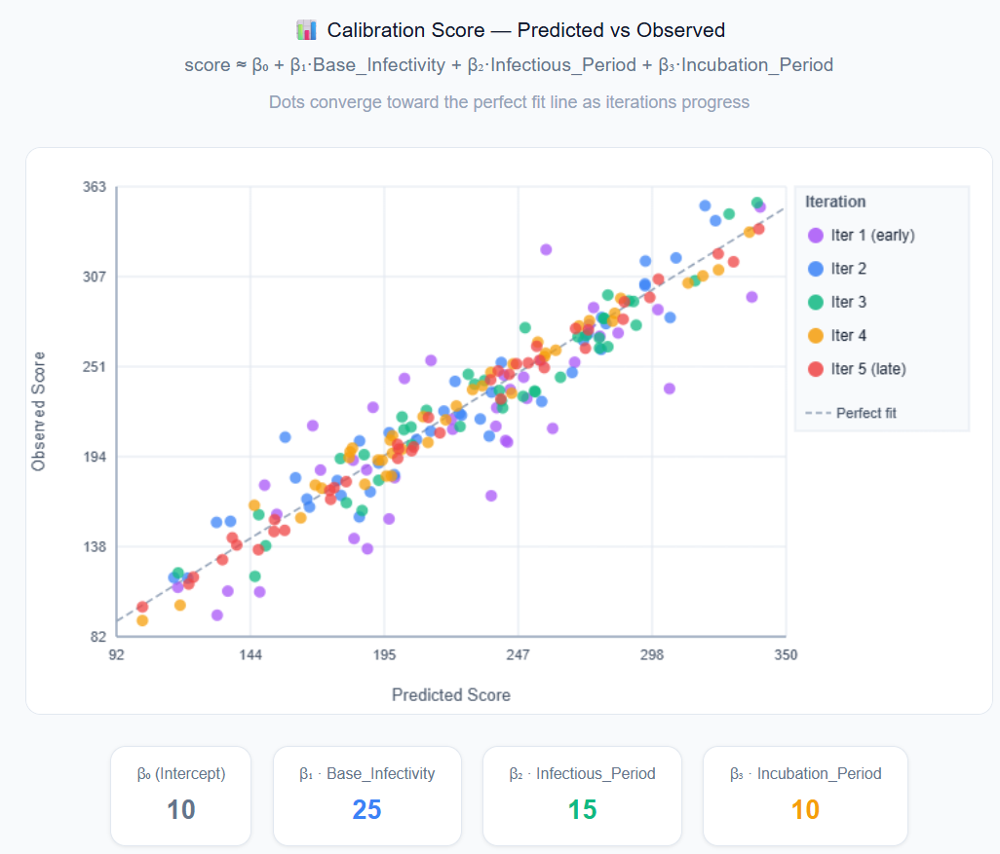

# Overview

**idmtools_calibra** is an iterative calibration framework for scientific and epidemic models. It runs parameter sweeps, compares model output to reference data, and updates the sampling strategy until convergence.

---

## Calibration workflow

The calibration loop is orchestrated by `CalibManager` and follows these steps each iteration:

1. **Sample** — `NextPointAlgorithm.get_samples_for_iteration()` generates a set of parameter combinations to evaluate.
2. **Configure** — `map_sample_to_model_input_fn` maps each sample row to the simulation task.
3. **Execute** — Simulations are submitted and run via the idmtools `Platform` (Container / COMPS / Slurm).
4. **Analyze** — `BaseCalibrationAnalyzer` compares model output to reference data and returns a likelihood or error score.
5. **Update** — `NextPointAlgorithm.set_results_for_iteration()` updates the algorithm state with the scores.
6. **Plot** — `BasePlotter.visualize()` generates diagnostic plots for the iteration.

Each iteration's state is written to `Calibration.json`, enabling **resume** from any iteration or phase.

---

## How OptimTool works: EMOD SIR example

The following walks through a concrete calibration of an EMOD SIR model (`examples/emod_sir/OutputOption1`) to illustrate how `OptimTool` narrows in on the right parameters.

### The problem

Three dynamic parameters control disease dynamics:

| Parameter | EMOD Name | Guess | Min | Max |
|-----------|-----------|-------|-----|-----|
| `a` | `Base_Infectivity_Constant` | 5 | 0 | 10 |
| `b` | `Infectious_Period_Exponential` | 5 | 0.1 | 10 |
| `c` | `Incubation_Period_Constant` | 5 | 0 | 20 |

The reference data is a single scalar — the timestep of peak prevalence:

```
metric,value
t_max,59.999
```

The goal is to find values of `a`, `b`, `c` such that the simulated epidemic peaks at t ≈ 60.


### Step 1: Samples become simulations

Each iteration, `OptimTool` generates ~25 parameter combinations. Each row runs one EMOD simulation:

| Sample | Base_Infectivity | Infectious_Period | Incubation_Period |
|--------|-----------------|-------------------|-------------------|
| 0      | 0.30            | 5.0               | 3.0               |
| 1      | 0.35            | 4.8               | 2.7               |
| 2      | 0.28            | 5.2               | 3.1               |
| ...    | ...             | ...               | ...               |

### Step 2: Each simulation gets a score

The analyzer compares the simulated infected curve to the reference data, producing a single fitness score per sample. The closer the simulation matches the reference, the higher the score.

### Step 3: OLS regression fits scores to parameters

`OptimTool` fits an OLS (Ordinary Least Squares) regression to the current iteration's samples and scores:

```
score ≈ β₀ + β₁·Base_Infectivity + β₂·Infectious_Period + β₃·Incubation_Period
```

With 25 samples and 4 unknowns, this is an overdetermined system. In matrix form:

```
Y = X · β + ε

Y = [score_1, score_2, ..., score_25]       (25×1 vector)

X = [[1, 0.30, 5.0, 3.0],
     [1, 0.35, 4.8, 2.7],
     ...
     [1, 0.32, 4.9, 2.9]]                    (25×4 matrix)

β = [β₀, β₁, β₂, β₃]                        (4×1, solved via (XᵀX)⁻¹XᵀY)
```

### Step 4: Gradient tells you which way to move

Say the fitted coefficients are:

- `β₁ = +50` → increasing infectivity improves fit
- `β₂ = −20` → decreasing infectious period improves fit
- `β₃ = +5`  → slightly longer incubation helps

The algorithm shifts the center point in that direction and draws new samples around it.

### Step 5: Repeat until convergence

```
Iteration 0:  Samples scattered around initial guess
               → scores vary a lot, OLS fits a plane

Iteration 1:  Center moves along gradient
               → samples now in a better region

Iteration 2:  Center moves again
               → simulated curves start matching reference

...

Iteration N:  Center has converged
               → best parameter values found
```

!!! note "What we are solving for"
    The **calibration goal** is to find the disease model parameters (`a`, `b`, `c`) — the values
    passed into EMOD that reproduce the observed epidemic. These are the final output of the calibration.

    The **β₀, β₁, β₂, β₃** above are OptimTool's internal OLS regression coefficients. They
    approximate the fitness landscape for the current iteration to estimate which direction to move
    the search center. They are a navigation tool, not the end result, and are discarded after each
    iteration.

    | | What they are | Role |
    |---|---|---|
    | `a`, `b`, `c` | EMOD model parameters | **Output** — what calibration is trying to find |
    | β₀, β₁, β₂, β₃ | OLS regression coefficients | **Internal** — gradient direction estimate, discarded each iteration |

### When R² is low

If the score–parameter relationship is highly nonlinear in the sampled region (common in SIR models, where small changes in infectivity can cause dramatic shifts in epidemic dynamics), the linear fit will be poor. In that case the algorithm jumps directly to the best-scoring sample rather than trusting the gradient direction. This makes `OptimTool` robust to nonlinear fitness landscapes.

---

## Algorithm selection

| Algorithm | Class | Strategy | Best for |
|-----------|-------|----------|----------|
| `OptimTool` | `OptimTool` | Adaptive OLS regression | General-purpose; start here |
| `IMIS` | `IMIS` | Bayesian importance sampling | When you need the full posterior distribution, not just the best point |
| `GPC` | `GPC` | Gaussian process surrogate | Smooth, low-dimensional parameter spaces |
| `SPSA` | `SPSA` | Stochastic gradient approximation | Noisy objective functions |
| `PSPO` | `PSPO` | Particle swarm / perturbation | Population-based optimization |
| `PBNB` | `OptimToolPBNB` | Progressive branch-and-bound | High-dimensional bounded spaces |

**OptimTool key tuning parameters:**

| Parameter | Default | Description |
|-----------|---------|-------------|
| `mu_r` | `0.1` | Mean fractional step size — how far to move each iteration |
| `sigma_r` | `0.02` | Step size standard deviation |
| `rsquared_thresh` | `0.5` | R² threshold; below this, fall back to best sample |
| `samples_per_iteration` | `100` | Simulations per iteration |

See [API Reference: Algorithms](api/algorithms.md) for full details on all algorithms.

---

## Multi-site calibration

Pass multiple sites to `CalibManager` to calibrate against several reference datasets simultaneously:

```python
from idmtools_calibra.rmse_site import RMSESiteSingleChannel

site_incidence = RMSESiteSingleChannel(
    name='incidence',
    reference_sources={'data': 'reference/incidence.csv'}
)
site_prevalence = RMSESiteSingleChannel(
    name='prevalence',
    reference_sources={'data': 'reference/prevalence.csv'}
)

calib = CalibManager(
    ...
    sites=[site_incidence, site_prevalence],
    ...
)
```

Each site contributes an independent score per simulation. The framework combines them (weighted by `analyzer.weight`) into a single total score used by the sampling algorithm.

---

## Key abstractions

| Class                                 | Module | Role                                              |
|---------------------------------------|---|---------------------------------------------------|
| `CalibManager`                        | `calib_manager` | Top-level orchestrator                            |
| `NextPointAlgorithm`                  | `algorithms/next_point_algorithm` | Abstract base for sampling strategies             |
| `OptimTool`                           | `algorithms/optim_tool` | Adaptive OLS regression-based algorithm (default) |
| `CalibSite` / `RMSESiteSingleChannel` | `calib_site`, `rmse_site` | Wraps reference data and analyzers                |
| `BaseCalibrationAnalyzer`             | `analyzers/base_calibration_analyzer` | Compares output to reference data                 |
| `IterationState`                      | `iteration_state` | Serializable per-iteration state                  |
| `BasePlotter`                         | `plotters/base_plotter` | Generates diagnostic plots                        |
| `BaseResampler`                       | `resamplers/base_resampler` | Post-calibration resampling strategies            |
| `ResumeManager`                       | `utilities/resume_manager` | Supports resuming from any iteration and phase    |

---

## Resume support

`CalibManager.run_calibration()` supports resuming from any iteration and phase:

```python
calib_manager.run_calibration(
    resume=True,
    iteration=2,          # resume from iteration 2
    iter_step='analyze',  # phase: 'commission', 'analyze', 'plot', or 'next_point'
    loop=True,            # continue to next iteration after resuming
    max_iterations=10,    # override max_iterations defined in CalibManager
    backup=True,          # backup Calibration.json before resuming
    dry_run=False,        # set True to preview without executing
)
```

### `iter_step` options

| Value | Behaviour |
|-------|-----------|
| `commission` | Start a new iteration with fresh parameter samples |
| `analyze` | Analyze existing simulation output from the given iteration |
| `plot` | Generate plots for the given iteration only |
| `next_point` | Advance directly to computing next iteration's samples |

---

## Example: EMOD SIR (OutputOption1)

The `examples/emod_sir/OutputOption1` example runs 6 iterations with 25 samples each against an EMOD-generic SIR model. The goal is to rediscover the true parameter values — `Base_Infectivity_Constant = 0.2` (β), `Infectious_Period_Exponential = 0.1` (γ), and `Incubation_Period_Constant` — that produce an epidemic peaking at t ≈ 60, starting only from broad initial guesses of 5 for all three.

```python
# settings.py
N_SAMPLES    = 25
N_REPLICATES = 1
N_ITERATIONS = 6
CALIBRATION_NAME = 'emod-sir'

CALIBRATION_PARAMETERS = [
    {'Name': 'a', 'MapTo': 'Base_Infectivity_Constant',    'Guess': 5, 'Min': 0,   'Max': 10.0, 'Dynamic': True},
    {'Name': 'b', 'MapTo': 'Infectious_Period_Exponential', 'Guess': 5, 'Min': 0.1, 'Max': 10,  'Dynamic': True},
    {'Name': 'c', 'MapTo': 'Incubation_Period_Constant',   'Guess': 5, 'Min': 0,   'Max': 20,   'Dynamic': True},
]
```

Run it:

```bash
python3 calibrate.py && python3 test_and_plot.py
```

`test_and_plot.py` sweeps over 10 `Run_Number` seeds using the best-found parameter values and plots the resulting infected curves against the reference.

See `examples/solar/` for the simplest starting point (2-parameter linear model), and `examples/emod_sir/OutputOption1/README.md` for the full EMOD SIR walkthrough.
