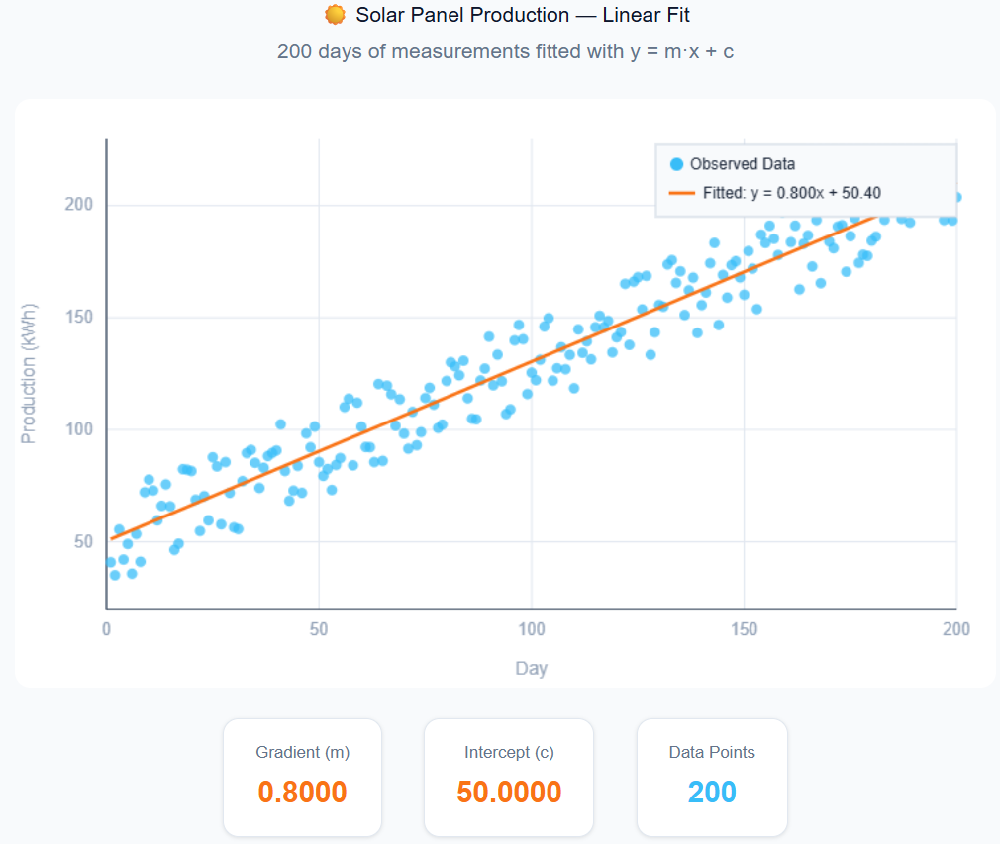

# Quick Start

This guide walks through the **solar example** — the simplest complete calibration in the repository — to get you from zero to a working calibration in minutes. The full code is in `examples/solar/`.

---

## The Problem

We have 200 days of solar panel production measurements. We want to fit a simple linear model:

```
y = m·x + c
```

The goal: find the gradient `m` and intercept `c` that best explain the observed data.

---

## Step 1: Reference Data

Place your observed data in a CSV:

```
# reference/production.csv
x,y
0,1.2
1,2.5
...
```

The first column is the independent variable (day), the second is the dependent variable (production).

---

## Step 2: Create a Site

A **site** pairs reference data with the analyzer that scores model output against it. For RMSE-based calibration, use the built-in `RMSESiteSingleChannel`:

```python
from idmtools_calibra.rmse_site import RMSESiteSingleChannel

site = RMSESiteSingleChannel(
    name='solar_site',
    reference_sources={'data': 'reference/production.csv'}
)
```

`RMSESiteSingleChannel` automatically wires up an `RMSEAnalyzer` that computes Root Mean Squared Error between the model output CSV and the reference.

---

## Step 3: Define Parameters

Tell `OptimTool` which parameters to calibrate and their search bounds:

```python
from idmtools_calibra.algorithms.optim_tool import OptimTool

params = [
    {'Name': 'gradient',  'Min': -5.0, 'Max': 5.0, 'Center': 0.0, 'Dynamic': True},
    {'Name': 'intercept', 'Min': -5.0, 'Max': 5.0, 'Center': 0.0, 'Dynamic': True},
]

algo = OptimTool(params=params, samples_per_iteration=25)
```

Each `Dynamic: True` parameter will be adapted each iteration. `Dynamic: False` holds the parameter fixed throughout calibration.

---

## Step 4: Define the Model Mapping

Write a callback that takes one parameter sample and applies it to the simulation task:

```python
def map_sample_to_model_input(simulation, sample):
    simulation.task.set_parameter('gradient',  sample['gradient'])
    simulation.task.set_parameter('intercept', sample['intercept'])
```

`sample` is a `pandas.Series` row with one value per calibrated parameter.

---

## Step 5: Create and Run CalibManager

```python
from idmtools_calibra.calib_manager import CalibManager
from idmtools_calibra.plotters.likelihood_plotter import LikelihoodPlotter
from idmtools.entities.command_task import CommandTask

task = CommandTask(command='python bin/linear_model.py')

calib = CalibManager(
    task=task,
    map_sample_to_model_input_fn=map_sample_to_model_input,
    sites=[site],
    next_point=algo,
    name='solar_calibration',
    max_iterations=10,
    plotters=[LikelihoodPlotter()],
)

calib.run_calibration()
```

That's it. `CalibManager` handles the rest: running 10 iterations of 25 simulations each, scoring results, and converging on the best `m` and `c`.

---

## Step 6: Inspect Results

After calibration completes, the output directory `solar_calibration/` contains:

```
solar_calibration/
├── Calibration.json          # full state for every iteration (resume support)
├── _plots/                   # Likelyhood summary score for each simulation
│   └── LL_all.csv
├── iter0/                        # iteration 0 outputs
│   ├── IterationState.json
│   ├── CalibrManager_0.json
|   ├── LL_constant.pdf
├── iter1/                        # iteration 1 outputs
...
```

Load results without re-running:

```python
cm = CalibManager.open_for_reading('solar_calibration')
best = cm.get_best_params()
print(best)
```

---

## Resuming a Calibration

If a calibration is interrupted, resume from where it left off:

```python
calib.run_calibration(resume=True, iteration=3, iter_step='analyze')
```

See [Overview → Resume Support](overview.md#resume-support) for all resume options.

---

## Next Steps

- [Overview](overview.md) — how OptimTool works, algorithm comparison, multi-site calibration
- [API Reference: CalibManager](api/idmtools_calibra.md#calibmanager) — all constructor and method options
- [API Reference: Algorithms](api/algorithms.md) — switch to IMIS, GPC, or other algorithms
- [Troubleshooting](troubleshooting.md) — common mistakes and fixes
