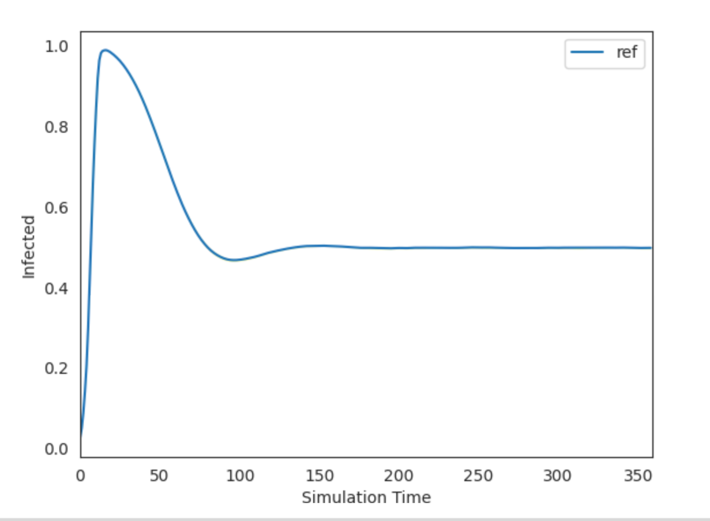

<!-- START doctoc generated TOC please keep comment here to allow auto update -->
<!-- DON'T EDIT THIS SECTION, INSTEAD RE-RUN doctoc TO UPDATE -->
**Table of Contents**

- [Welcome to the EMOD SIS Demo of idmtools-calibra.](#welcome-to-the-emod-sis-demo-of-idmtools-calibra)
      - [Explanation](#explanation)
        - [Reference Data](#reference-data)
        - [Model](#model)
        - [Settings](#settings)
        - [To Run](#to-run)
        - [Output](#output)

<!-- END doctoc generated TOC please keep comment here to allow auto update -->

# Welcome to the EMOD SIS Demo of idmtools-calibra.
#### Explanation
This is the third example/demo. Here, we have a very simple SIS model (in EMOD). It also has 3 parameters:
```
* Base_Infectivity_Constant (how infectious?)
* Infectious_Period_Exponential (how long infectious?)
* Incubation_Period_Constant (how long latent?)
* Acquisition_Blocking_Immunity_Decay_Rate (how fast immunity decays)
* Acquisition_Blocking_Immunity_Duration_Before_Decay (how long before immunity decays)
```
These 5 params ought to be able to get us to almost any regular SIS set of curves.

 
##### Reference Data
The reference data is a single scalar: The mean prevalence over the last 60 days of the sim.
```
metric,value
mean_prev,0.5
```

So we have the epidemic peeking at t=60. (We use 59.999 to avoid a divide by zero error which occurs with 60.0.)

##### Model
The model is EMOD-generic. This should get installed by doing:
```
pip3 install -r requirements.txt
```
or
```
pip3 install emod-generic
```

##### Settings
* N_SAMPLES = 125 (5 samples, 3 'axes')
* N_REPLICATES = 1 (with so many samples we hopefully don't need to worry about replicates for now)
* N_ITERATIONS = 10 (let's stop before too long and see how we're doing)

##### To Run
calibrate.py is the main run script of this example. Please refer to it for example information

calibrate.py is run via:
```
python3.9 calibrate.py

```
Replace 'python3.9' as appropriate for your machine.

##### Output
Option 1) In the first case, we let calibra run for 10 iterations.

test_and_plot.py runs a sweep over 10 Run_Number values using the best values found for the 5 parameters. It should look something like this:

